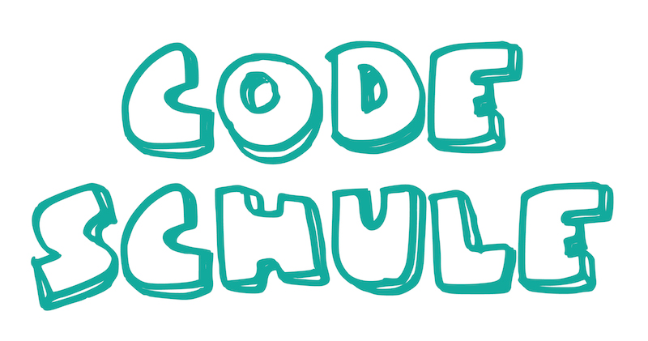

## What is CodeSchule

"CodeSchule" is for children between 4 to 9 years of age and will teach them the basics of programming. This repository contains material and information about CodeSchule.

CodeSchule is originally from Finland (by name [Koodikoulu](http://koodikoulu.fi/)). The original father of the idea and the principal of the 'Koodikoulu' is Juha Paananen ([@raimohanska](https://github.com/raimohanska)). We are greatful for him to open sourcing this idea and sharing the joy of programming to children all over the world!

## Information
To find information about future "CodeSchule" in Germany, please see [Codeschule page](http://codeschule.org/de/), Twitter and Facebook with #codeschule. You can also organize CodeSchule yourself! 

## Turtle Roy

The software used in CodeSchule is Turtle Roy. It was made by [@raimohanska](https://github.com/raimohanska).

The actual software is here: [http://turtle-roy.herokuapp.com/](http://turtle-roy.herokuapp.com/)

The source code of Turtle Roy is here: [https://github.com/raimohanska/turtle-roy](https://github.com/raimohanska/turtle-roy)

## Material

[Exercises](de.md)
[Instructions](for_parents.md)
[Diploma](urkunde_codeschule.pdf)

## Links

[Codeschule in Germany](http://codeschule.org/de/)

[Koodikoulu in Finland](http://koodikoulu.fi/)

[Materials in Finnish](https://github.com/koodikoulu/koodikoulu)

- - -

This material is licensed under [Creative Commons Attribution-ShareAlike 4.0 International (CC BY-SA 4.0)](http://creativecommons.org/licenses/by-sa/4.0/deed.en).

