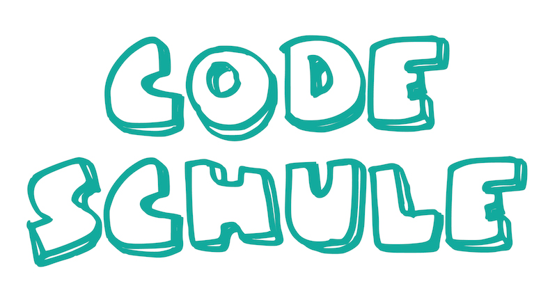

## Was ist die CodeSchule

Die "CodeSchule" ist für Kinder zwischen 4 und 9 Jahren gedacht und bringt den Kindern das Programmieren am Computer nahe. Dieses repo beinhaltet Informationen und Dateien für die CodeSchule.

Die erste CodeSchule entstand in Finnland (Bezeichnung dort ist [Koodikoulu](http://koodikoulu.fi/)). Der Urvater der 'Koodikoulu' ist Ihr Erfinder ist Juha Paananen ([@raimohanska](https://github.com/raimohanska)). Wir sind dankbar dafür, dass er seine Idee umgesetzt hat und als open source anbietet um damit seine Freude am Programmieren mit allen Kindern auf der Welt zu teilen.

Wenn Du einen Überblick über die CodeSchule bekommen möchtest schaue hier rein [video] (http://vimeo.com/111285072).

## Information
Weitere Informationen und Termine über die "CodeSchule" in Deutschland findest Du hier [Codeschule page](http://codeschule.org/de/), Twitter und Facebook mit #codeschule. Hat Dich das Konzept überzeugt? - Du kannst auch in Eurem Unternehmen eine CodeSchule stattfinden lassen! 

## Turtle Roy

In der CodeSchule wird die Software Turtle Roy genutzt. Sie wurde programmiert von [@raimohanska](https://github.com/raimohanska).

Die Software findest Du hier: [http://turtle-roy.herokuapp.com/](http://turtle-roy.herokuapp.com/)

Den SourceCode von Turtle Roy findest Du hier: [https://github.com/raimohanska/turtle-roy](https://github.com/raimohanska/turtle-roy)

## Material

[Exercises](de.md)
[Instructions](for_parents.md)
[Diploma](urkunde_codeschule.pdf)

## Links

[Codeschule in Deutschland](http://codeschule.org/de/)

[Koodikoulu in Finnland](http://koodikoulu.fi/)

[Materialien auf Finnisch](https://github.com/koodikoulu/koodikoulu)

- - -

This material is licensed under [Creative Commons Attribution-ShareAlike 4.0 International (CC BY-SA 4.0)](http://creativecommons.org/licenses/by-sa/4.0/deed.en).